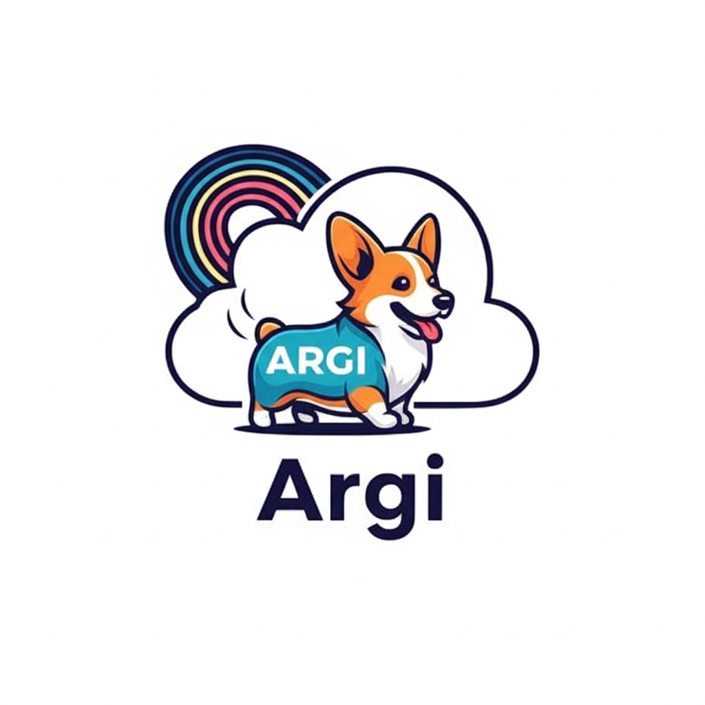

# 🚀 ระบบตรวจสอบสถานะ Uptime และ Domain Monitor



## 📖 เกี่ยวกับโปรเจค

ระบบตรวจสอบสถานะ Uptime และ Domain Monitor เป็นแอปพลิเคชันที่ออกแบบมาเพื่อตรวจสอบและติดตามสถานะของเว็บไซต์ และโดเมนต่างๆ อย่างต่อเนื่อง โดยมีจุดประสงค์หลักเพื่อให้ผู้ใช้งานสามารถทราบสถานะของเซอร์วิสออนไลน์ได้แบบเรียลไทม์

## ✨ ฟีเจอร์หลัก

### 🔍 การตรวจสอบ Uptime
- ✅ ตรวจสอบสถานะเว็บไซต์แบบเรียลไทม์
- ⏱️ วัดเวลา Response Time
- 📊 สร้างกราฟแสดงสถิติการทำงาน
- 🔔 แจ้งเตือนเมื่อเซอร์วิสล่ม

### 🌐 การตรวจสอบ Domain
- 🔐 ตรวจสอบวันหมดอายุของ SSL Certificate
- 📅 ตรวจสอบวันหมดอายุของโดเมน
- 🔒 ตรวจสอบความปลอดภัยของเว็บไซต์
- ⚠️ แจ้งเตือนก่อนหมดอายุ

### 📱 Dashboard และ Monitoring
- 📈 หน้าแดชบอร์ดแสดงสถานะภาพรวม
- 📋 รายงานสถิติการทำงาน
- 🕐 ประวัติการทำงานย้อนหลัง
- 📧 ระบบแจ้งเตือนผ่าน Email/LINE/Discord

## 🛠️ เทคโนโลยีที่ใช้

### Backend
- **Language**: Python/Node.js
- **Framework**: FastAPI/Express.js
- **Database**: PostgreSQL/MongoDB
- **Task Queue**: Celery/Bull

### Frontend
- **Framework**: React.js/Vue.js
- **UI Library**: Material-UI/Ant Design
- **Charts**: Chart.js/D3.js
- **Real-time**: WebSocket

### Infrastructure
- **Containerization**: Docker
- **Orchestration**: Docker Compose
- **Monitoring**: Prometheus + Grafana
- **Deployment**: AWS/GCP/Azure

## 🚀 การติดตั้งและใช้งาน

### ความต้องการของระบบ
- Docker และ Docker Compose
- Git
- Port 3000 (Frontend) และ 8000 (Backend)

### วิธีการติดตั้ง

1. **Clone โปรเจค**
```bash
git clone https://github.com/yourusername/uptime-domain-monitor.git
cd uptime-domain-monitor
```

2. **ตั้งค่า Environment Variables**
```bash
cp .env.example .env
# แก้ไขค่าใน .env ตามความต้องการ
```

3. **รันด้วย Docker Compose**
```bash
docker-compose up -d
```

4. **เข้าใช้งาน**
- Frontend: http://localhost:3000
- Backend API: http://localhost:8000
- Grafana Dashboard: http://localhost:3001

### การตั้งค่าเบื้องต้น

1. **เพิ่มเว็บไซต์ที่ต้องการตรวจสอบ**
2. **ตั้งค่าการแจ้งเตือน**
3. **กำหนดช่วงเวลาการตรวจสอบ**
4. **ตั้งค่า Alert Rules**

## 📊 การใช้งาน

### การเพิ่มเว็บไซต์ใหม่
1. ไปที่หน้า "Add New Monitor"
2. ใส่ URL ของเว็บไซต์
3. เลือกประเภทการตรวจสอบ (HTTP/HTTPS/TCP/PING)
4. ตั้งค่าช่วงเวลาการตรวจสอบ
5. กดบันทึก

### การดู Dashboard
- **Overview**: ภาพรวมสถานะทั้งหมด
- **Uptime Stats**: สถิติการทำงาน
- **Response Time**: กราฟเวลา Response
- **SSL Monitor**: สถานะ SSL Certificate
- **Domain Expiry**: วันหมดอายุโดเมน

### การตั้งค่าการแจ้งเตือน
1. ไปที่หน้า "Alert Settings"
2. เลือกช่องทางการแจ้งเตือน
3. ตั้งค่าเงื่อนไขการแจ้งเตือน
4. ทดสอบการส่งข้อความ

## 🔧 การตั้งค่าขั้นสูง

### การตั้งค่า Database
```yaml
# docker-compose.yml
database:
  image: postgres:13
  environment:
    POSTGRES_DB: monitor_db
    POSTGRES_USER: admin
    POSTGRES_PASSWORD: password
```

### การตั้งค่า Monitoring Intervals
```json
{
  "default_interval": 60,
  "critical_sites": 30,
  "ssl_check": 86400,
  "domain_check": 86400
}
```

## 📈 API Documentation

### Endpoints หลัก
- `GET /api/monitors` - รายการเว็บไซต์ที่ตรวจสอบ
- `POST /api/monitors` - เพิ่มเว็บไซต์ใหม่
- `GET /api/stats/{monitor_id}` - สถิติของเว็บไซต์
- `GET /api/uptime/{monitor_id}` - ข้อมูล Uptime
- `GET /api/ssl/{domain}` - ข้อมูล SSL Certificate

### Authentication
```bash
# ใช้ Bearer Token
curl -H "Authorization: Bearer YOUR_TOKEN" \
     -X GET https://your-domain.com/api/monitors
```

## 🔐 Security

- 🔑 JWT Authentication
- 🛡️ Rate Limiting
- 🔒 HTTPS Only
- 🔐 API Key Management
- 📝 Audit Logging

## 🐛 การแก้ไขปัญหา

### ปัญหาที่พบบ่อย

**Q: ระบบไม่สามารถตรวจสอบเว็บไซต์ได้**
A: ตรวจสอบ Network connectivity และ Firewall settings

**Q: การแจ้งเตือนไม่ทำงาน**
A: ตรวจสอบการตั้งค่า SMTP และ API Keys

**Q: Database Connection Error**
A: ตรวจสอบการตั้งค่า Database ใน .env file

### Log Files
```bash
# ดู logs ของ application
docker-compose logs -f app

# ดู logs ของ database
docker-compose logs -f db
```

## 🤝 การมีส่วนร่วม

1. Fork โปรเจค
2. สร้าง Feature Branch (`git checkout -b feature/AmazingFeature`)
3. Commit การเปลี่ยนแปลง (`git commit -m 'Add some AmazingFeature'`)
4. Push ไป Branch (`git push origin feature/AmazingFeature`)
5. เปิด Pull Request

## 📝 Changelog

### Version 1.0.0
- ✨ ระบบตรวจสอบ Uptime พื้นฐาน
- ✨ ระบบตรวจสอบ SSL Certificate
- ✨ Dashboard แสดงผล
- ✨ ระบบแจ้งเตือน Email

### Version 1.1.0 (Coming Soon)
- 🔄 Multi-region monitoring
- 📱 Mobile app
- 🔗 API integrations
- 📊 Advanced analytics

## 📄 License

โปรเจคนี้ใช้ license MIT - ดู [LICENSE](LICENSE) file สำหรับรายละเอียด

## 👥 ทีมผู้พัฒนา

- **Lead Developer**: [Your Name]
- **Backend Developer**: [Developer Name]
- **Frontend Developer**: [Developer Name]
- **DevOps Engineer**: [Engineer Name]

## 📞 ติดต่อ

- 📧 Email: support@your-domain.com
- 🌐 Website: https://your-domain.com
- 💬 Discord: https://discord.gg/your-server
- 📱 LINE: @your-line-id

---

⭐ หากโปรเจคนี้มีประโยชน์กับคุณ อย่าลืม Star ⭐ ให้กับเราด้วยนะครับ! 